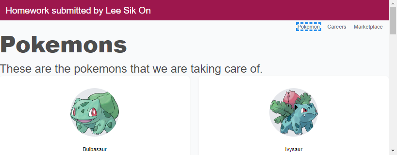

Three assignments are incorporated into one project.
-	Pokemon list, first take home homework from Day 1.
-	Career page: second take home homework from Day 1.
-	Market place, take home homework from Day 2.
 
On opening the app, Pokemons page is loaded.  On the top right corner is a navigation menu where you can switch between the three homework.

 
Career page uses array in program storage to keep postings.  The same 10 postings are loaded every time the program runs.  Updates persist only during that session.
 
Market place page uses API to access data.
 
Both handle inquire, page up/down, add, update, and delete.
 
Marketplace captures imageUrl field so pictures can be added and changed.
 

